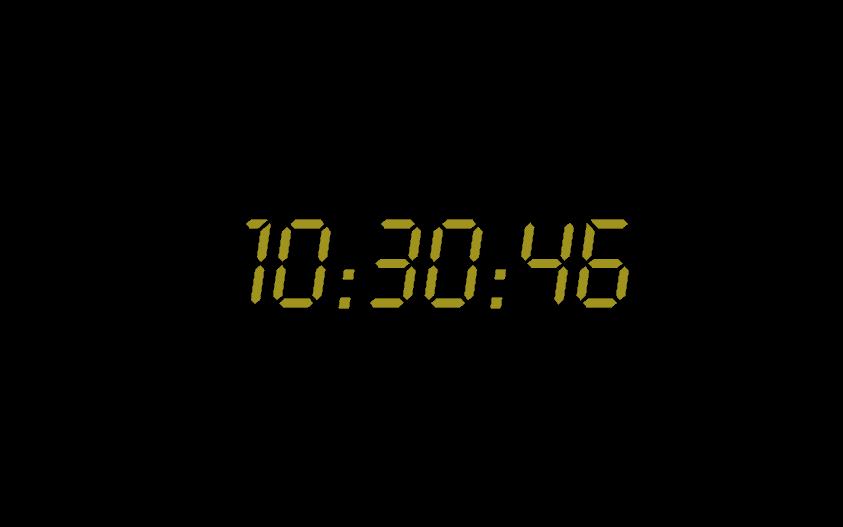

24clock
====

This is a "Twenty-Four"-inspired screen saver for Linux that I have revamped from an old implementation I've had in 2003.

### Building on Fedora for the Mate desktop ###

Do:

    sudo yum install mock && ./packaging/build-srpm -o . -m -

This will generate the RPMs in the current directory.
